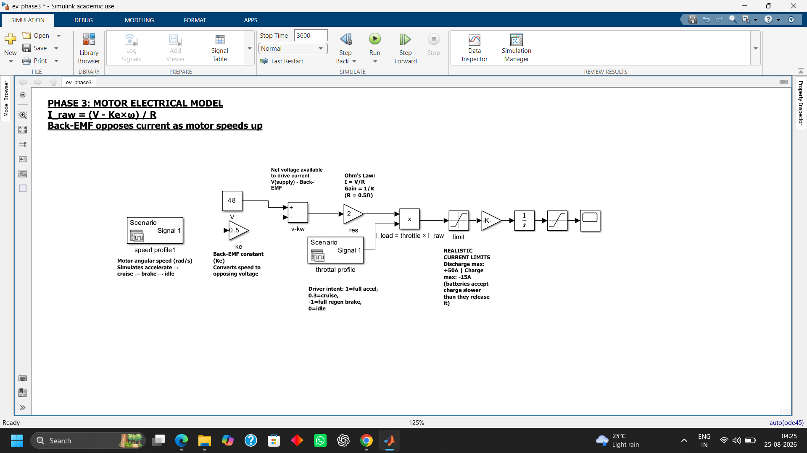
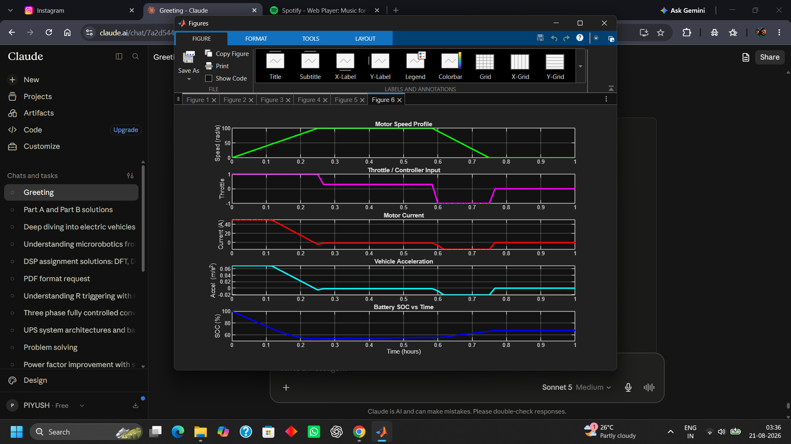
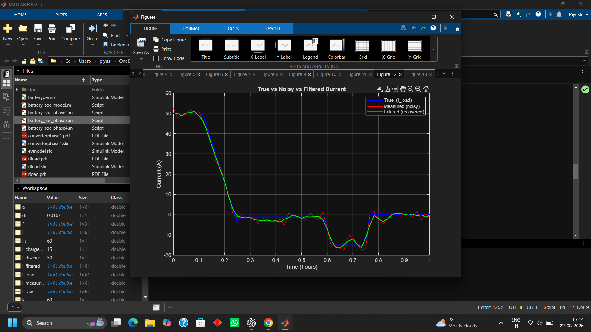
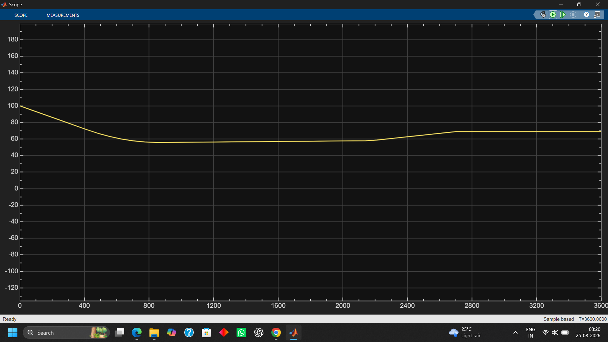

# EV Powertrain Simulator

A simulation of an electric vehicle's core systems — battery, motor, controller, and signal processing — built from first principles in **MATLAB** and **Simulink**.

This project was built to deeply understand how the pieces of an EV powertrain interact, not just to produce a working script. Every phase started from the governing physical equation, was implemented, run, and then debugged using physical reasoning whenever the output looked wrong.



## What it simulates

- **Battery State of Charge (SOC)** using Coulomb counting
- **A driving cycle** (accelerate → cruise → brake → idle) with **regenerative braking**
- **Motor electrical behaviour** — back-EMF, Ohm's law, torque — driving current directly from vehicle speed and throttle input
- **Vehicle dynamics** — torque → force → acceleration via Newton's second law
- **Realistic sensor noise and signal processing** — FFT frequency analysis and a moving-average filter to recover a clean signal from a noisy one

It was built twice: once as MATLAB code (4 phases) and once as an equivalent Simulink block diagram (3 phases), to understand the same physics two different ways.

## Results

**MATLAB — full signal chain (throttle → current → acceleration → SOC)**


**MATLAB — signal processing: recovering a clean current signal from a noisy sensor reading**


**Simulink — same physics, block-diagram implementation, matching SOC result**


## Project structure

```
EV_Powertrain_Simulator/
├── matlab/
│   ├── battery_soc_model.m      # Phase 1: Battery SOC (Coulomb counting)
│   ├── battery_soc_phase2.m     # Phase 2: Driving profile + regen braking
│   ├── battery_soc_phase3.m     # Phase 3: Motor model + throttle + vehicle dynamics
│   └── battery_soc_phase4.m     # Phase 4: Sensor noise, FFT, filtering
├── Simulink/
│   ├── ev_phase1.slx            # Battery SOC block model
│   ├── ev_phase2.slx            # Driving profile with Signal Editor
│   ├── ev_phase3.slx            # Motor model in blocks (annotated)
│   ├── driving_profile.mat
│   ├── omega_profile.mat
│   └── throttle_profile.mat
├── images/                      # Result screenshots used in this README
└── EV_Powertrain_Simulator_Notes.pdf   # Full concept + formula + debugging reference
```

## Core equations

**Battery SOC (Coulomb counting)**
```
SOC(t) = SOC0 - (100/Q) x ∫ I dt
```

**Motor current (Ohm's law with back-EMF)**
```
I_raw = (V - Ke x ω) / R
I_load = throttle x I_raw
```

**Vehicle dynamics**
```
F = T / r_wheel        (T = Kt x I)
a = F / m
```

**Moving average filter (FIR)**
```
y[n] = (1/M) x Σ x[n-k],  for k = 0..M-1
```

Full formula sheet, parameter values, and every design decision explained in [`EV_Powertrain_Simulator_Notes.pdf`](EV_Powertrain_Simulator_Notes.pdf).

## Key engineering decisions and debugging stories

- **Asymmetric charge/discharge current limits** — real batteries accept charge much more slowly than they release it, so discharge is capped at 50A while charging/regen is capped at 15A.
- **Battery capacity scaled to 20Ah** — the original 2Ah battery was too small relative to real motor currents (up to 96A at stall); a 15A regen current over 10 minutes alone would have exceeded the entire pack, causing unrealistic instant saturation. Traced with hand-calculated Ah numbers before changing anything.
- **Throttle/controller layer added** — raw motor physics with no controller implied ~96A of "phantom current" even while the car was parked (idle). A throttle signal representing driver intent (-1 to 1) fixes this by scaling current to zero when the pedal isn't pressed.
- **Units mismatch in Simulink** — a gain calculated for an "hours" time base silently broke when the model switched to a "seconds" time base, causing SOC to crash 3600x faster than expected. Same class of bug as keeping `dt` in hours to match Amp-hours back in the MATLAB version.
- **Block order matters, not just block values** — a correctly-configured Saturation block did nothing because it was placed *after* the signal had already been scaled down to a tiny SOC-rate number instead of clamping the raw current itself.

## Tools used

MATLAB, Simulink (Signal Editor, Integrator, Saturation, Product, Sum, Gain blocks), Coulomb counting, FFT / DTFT-based signal analysis, FIR filtering.

## Author

Piyush — built as a self-directed project alongside coursework in Digital Signal Processing, with an interest in the EV industry.
